# Architecture Diagrams

This document contains visual diagrams of the agent framework architecture using Mermaid syntax.

---

## System Overview

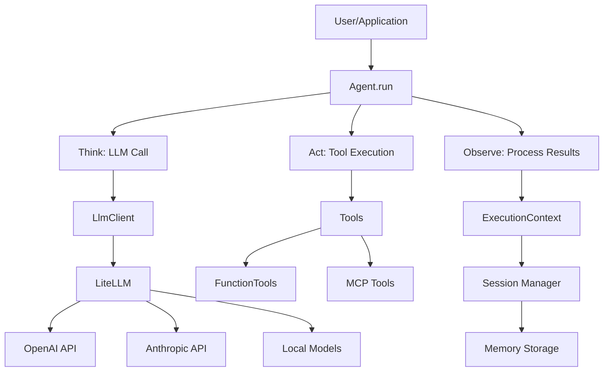

---

## Agent Execution Flow

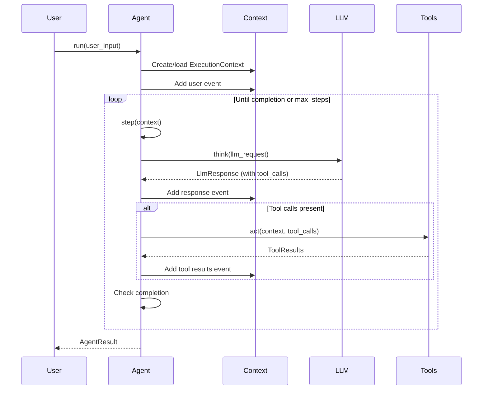

---

## Data Model Relationships

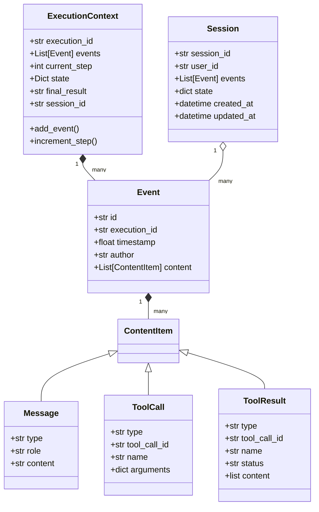

---

## Tool System Architecture

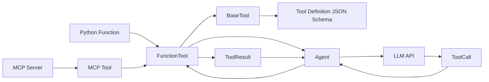

---

## Memory Optimization Flow

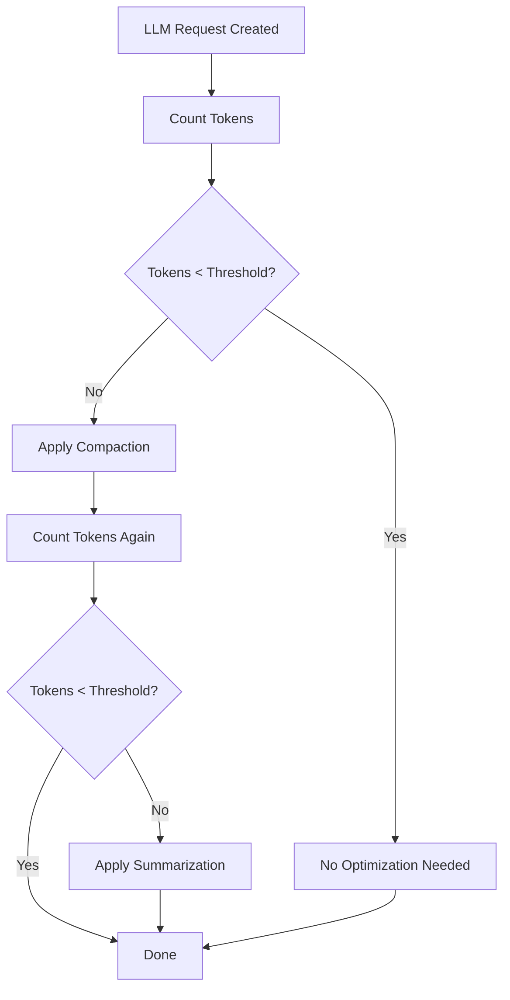

---

## Session Management Flow

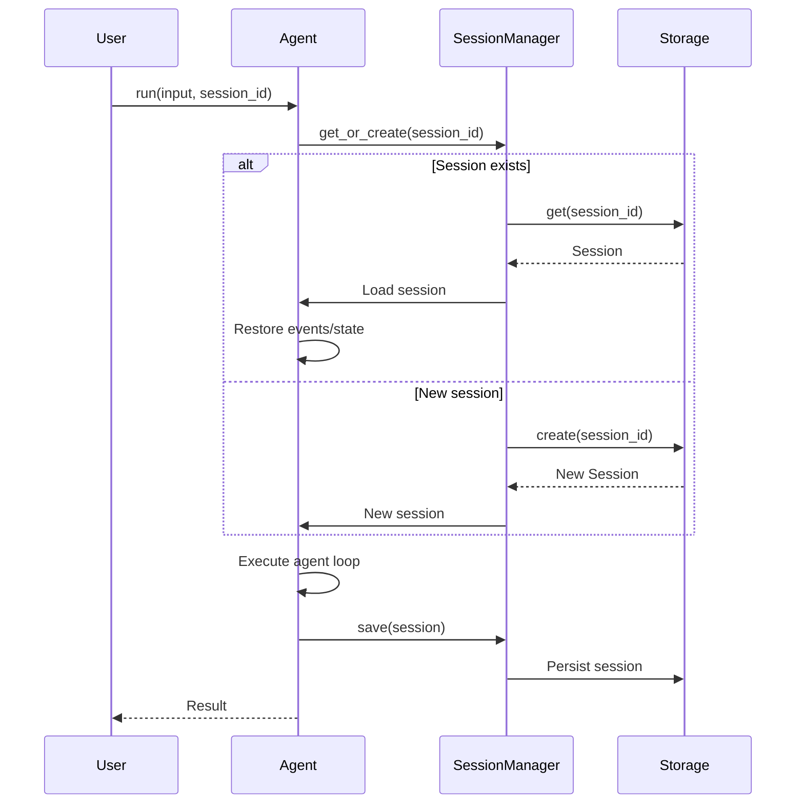

---

## MCP Integration Flow

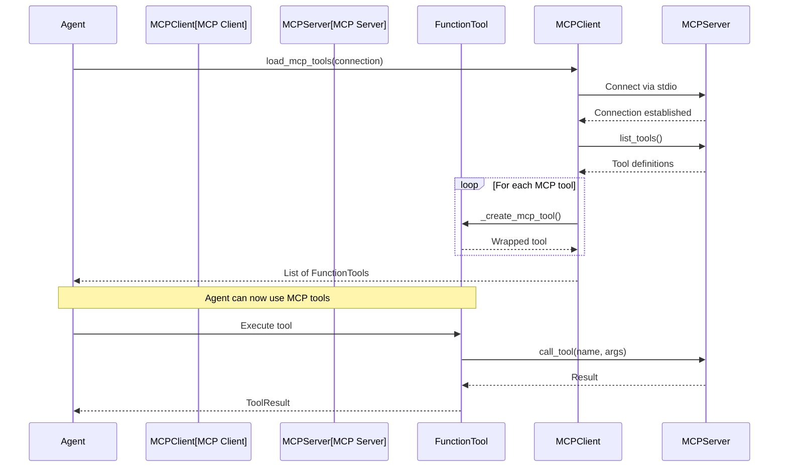

---

## Web Application Architecture

```mermaid
graph TB
    Browser[Browser] --> Frontend[HTML/CSS/JS]
    Frontend --> API[FastAPI Backend]
    
    API --> ChatEndpoint[/api/chat]
    API --> UploadEndpoint[/api/upload]
    API --> ToolsEndpoint[/api/tools]
    API --> SessionsEndpoint[/api/sessions]
    
    ChatEndpoint --> Agent[Agent Framework]
    UploadEndpoint --> FileStorage[File Storage]
    ToolsEndpoint --> ToolRegistry[Tool Registry]
    SessionsEndpoint --> SessionManager[Session Manager]
    
    Agent --> LlmClient[LlmClient]
    Agent --> Tools[Tools]
    Agent --> Memory[Memory Manager]
    
    LlmClient --> LiteLLM[LiteLLM]
    Tools --> FunctionTools[Function Tools]
    Memory --> SessionManager
```

---

## Request/Response Flow

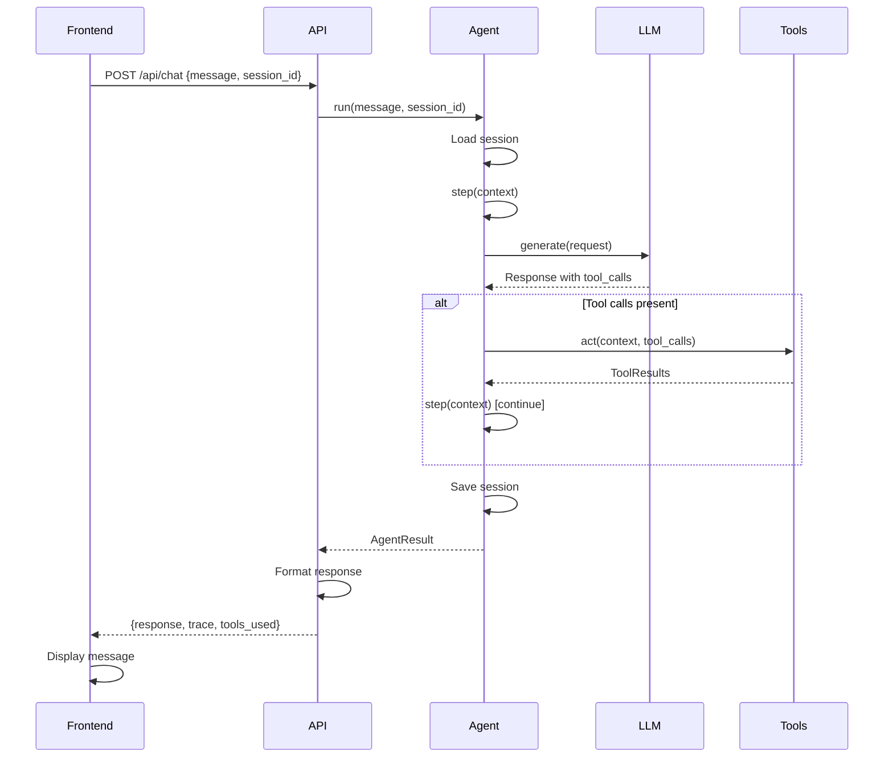

---

## Tool Execution Details

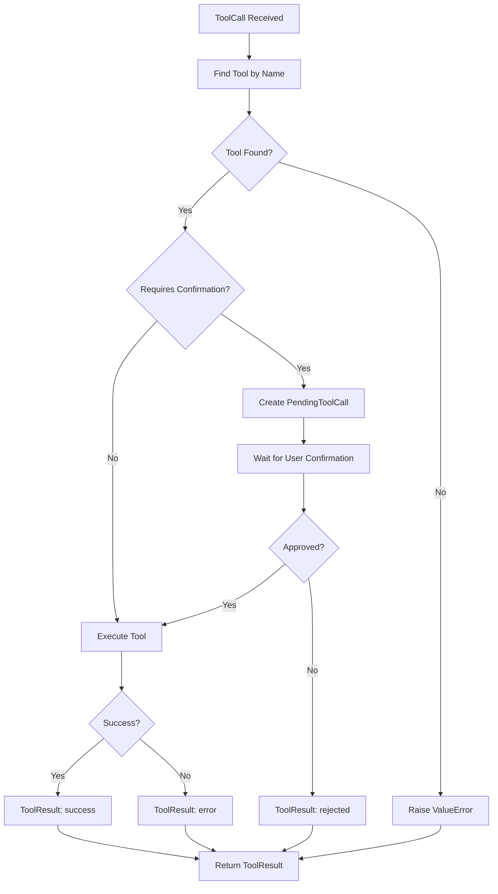

---

## Memory Optimization Strategies

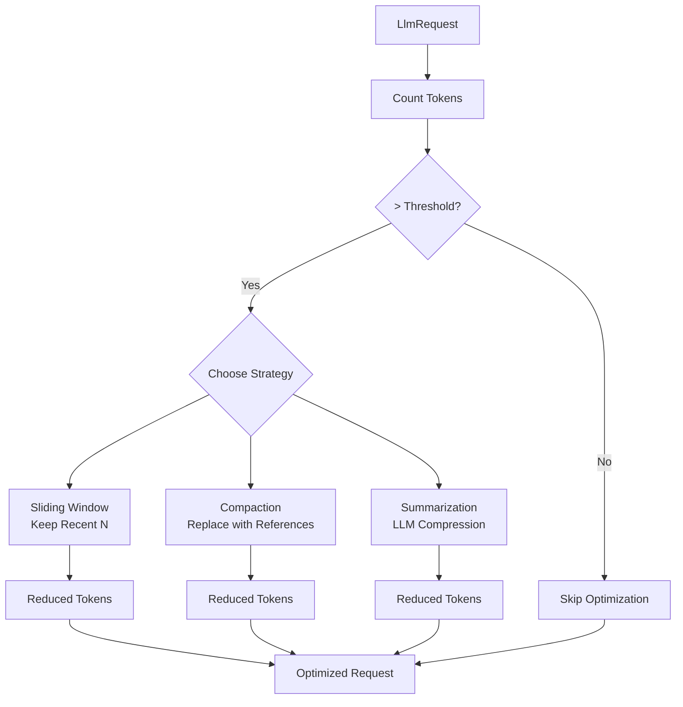

---

## Component Dependencies

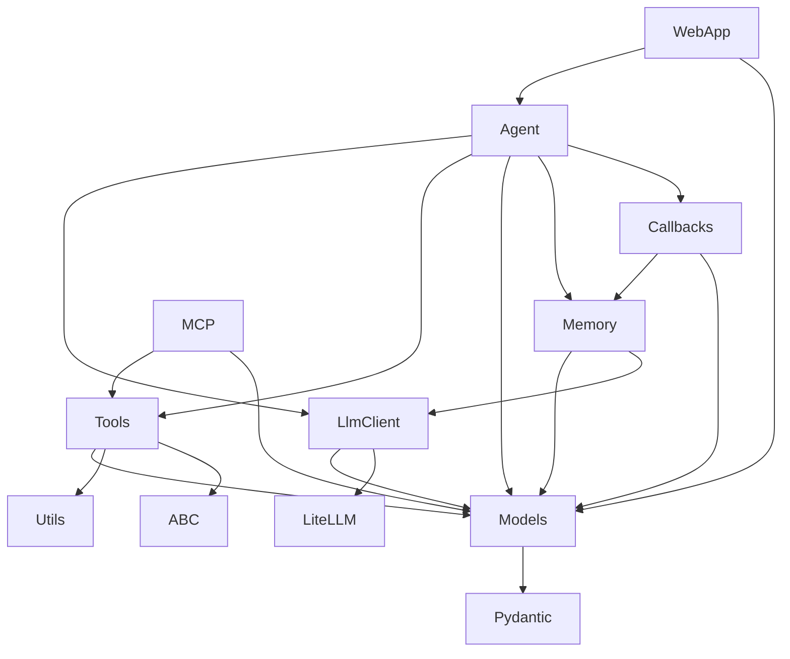

---

## State Management

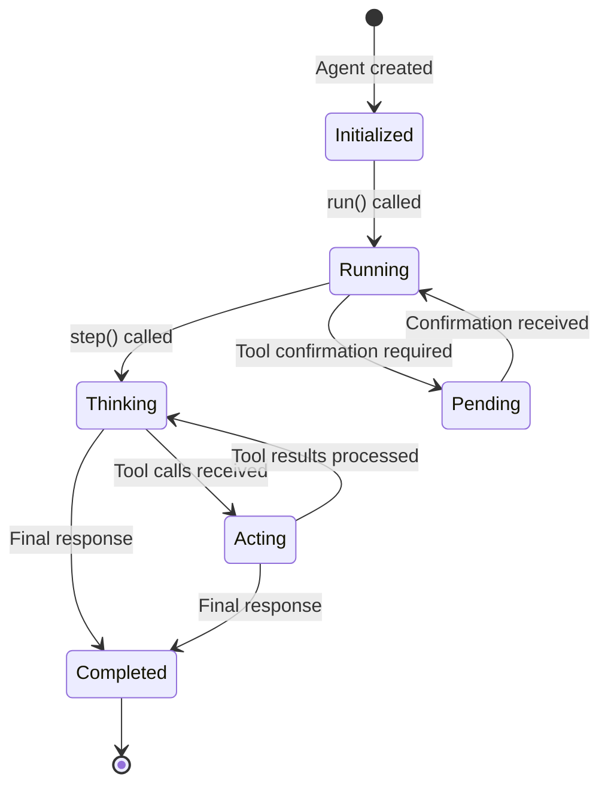

---

## Error Handling Flow

```mermaid
flowchart TD
    Start[Operation] --> Try{Try}
    Try -->|Success| Success[Return Result]
    Try -->|Error| Catch[Catch Exception]
    
    Catch --> ErrorType{Error Type?}
    ErrorType -->|LLM Error| LLMError[Return LlmResponse with error_message]
    ErrorType -->|Tool Error| ToolError[Return ToolResult with error status]
    ErrorType -->|Network Error| NetworkError[Retry or Return Error]
    ErrorType -->|Validation Error| ValidationError[Return Validation Error]
    
    LLMError --> Log[Log Error]
    ToolError --> Log
    NetworkError --> Log
    ValidationError --> Log
    
    Log --> ReturnError[Return Error to User]
    Success --> [*]
    ReturnError --> [*]
```

---

## Usage Examples

These diagrams can be:
1. Included in video thumbnails
2. Shown during explanations
3. Added to documentation
4. Used in presentations
5. Embedded in blog posts

To render these diagrams:
- Use Mermaid Live Editor: https://mermaid.live/
- Use GitHub (renders automatically in .md files)
- Use VS Code with Mermaid extension
- Use documentation tools like MkDocs

